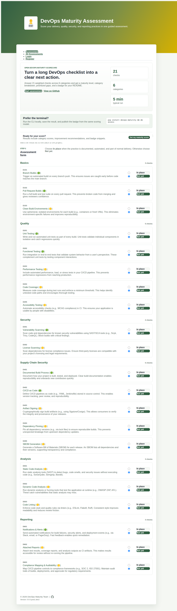
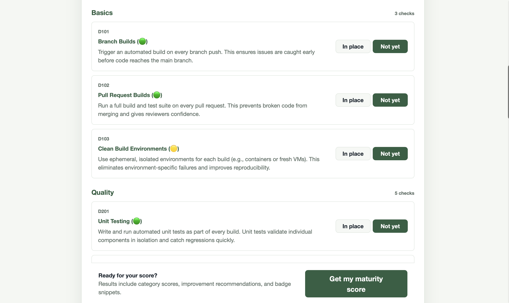
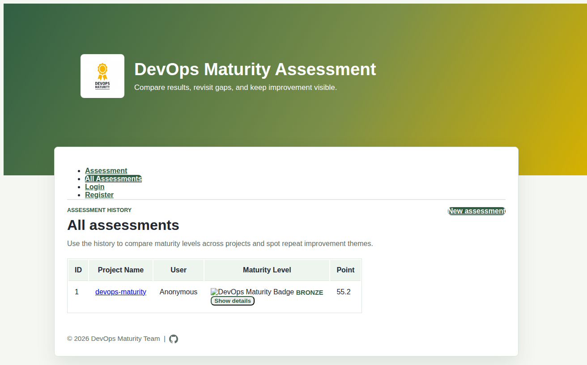

# Web interface

The web interface provides the same assessment workflow in a browser-based form, with built-in history tracking and visual reports.

## Starting the web app

```bash
git clone https://github.com/devops-maturity/devops-maturity.git
cd devops-maturity
pip install nox
nox -s preview
```

Open [http://127.0.0.1:8000](http://127.0.0.1:8000) in your browser.

## Workflow

1. Register or log in (username/password, or Google / GitHub OAuth if configured).
2. Open the **Assessment** tab and enter your project name and URL.
3. For each criterion, select **In place** or **Not yet**.
4. Submit the form to see your maturity score, level, category breakdown, and improvement priorities.
5. Visit **All Assessments** to compare runs and edit historical entries.

## Screenshots

**Assessment home** — enter project details and answer criteria:



**Assessment result** — score, level, category breakdown, and recommendations:



**Assessment history** — compare all past runs for a project:



## Authentication

By default, users register and log in with a username and password.

Google and GitHub OAuth can be enabled by setting the appropriate environment variables. See [Configuration — OAuth](../reference/configuration.md#oauth-for-the-web-interface) for details.
